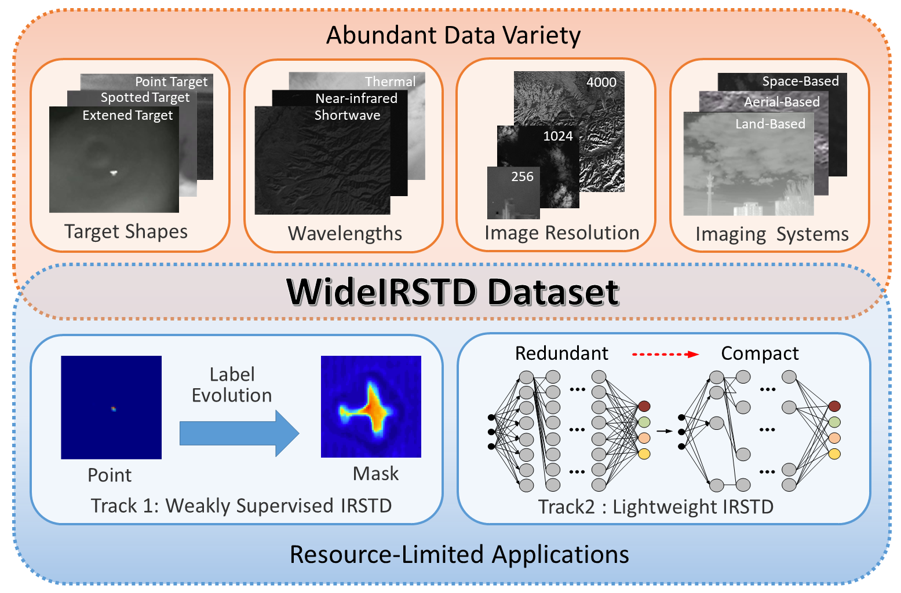
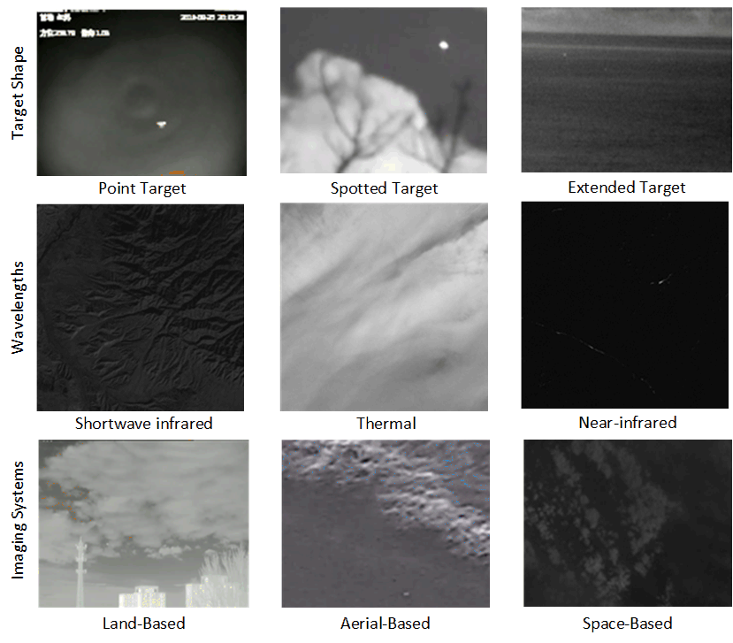

# LimitIRSTD Dataset for ICPR 2024 Resource-Limited Infrared Small Target Detection Challenge

This is the official website of the **LimitIRSTD** dataset.

## 1. Dataset Description

  

Fig. 1. An illustration of LimitIRSTD dataset.  

LimitIRSTD dataset is consisted of seven public datasets SIRST-V2, IRSTD-1K, IRDST, NUDT-SIRST, NUDT-SIRST-Sea, NUDT-MIRSDT, Anti-UAV and a dataset developed by the team of National University of Defense Technology (NUDT), including simulated land-based and space-based data, and real manually annotated space-based data. As shown in Fig.~\ref{Fig-dataset}, the dataset contains images with various target shapes (e.g., point target, spotted target, extended target), wavelengths (e.g., near-infrared, shortwave infrared and thermal), image resolution (e.g., 256, 512, 1024, 3200, etc.), at varied imaging systems (e.g., land-based, aerial-based and space-based imaging systems). Figure 2 shows some example images of the training sets.

  

Fig. 2. Example images of LimitIRSTD dataset.  

This dataset is used to evaluate the performance of infrared small target detection (IRSTD) under resource-limited conditions (e.g., Track 1: Weakly Supervised IRSTD Under Single Point Supervision, Track 2: Lightweight IRSTD Pixel-level Supervision). 

For track 1, 6000 images with coarse point annotation (i.e., GT point is located around the centroid of the GT mask under Gaussian distribution) are used for training. and 500 images are used for test.

For track 2, 9000 images with groundtruth (GT) mask annotation are used for trainning, and 2000 images are used for test.

## 2. Downloads

Download for Track 1 data. [[BaiduYun](https://pan.baidu.com/s/1x7mtLMtxpC8Oxm4sa9Y9mA?pwd=1113)]

Download for Track 2 data. [[BaiduYun](https://pan.baidu.com/s/1qAO67_h46CWCoTyd3sot2Q?pwd=1113)]

## 3. Challenge Results

        
## 4. Contact
Please contact yingxinyi18@nudt.edu.cn if you have any questions.

## 5. Baseline Methods
1. Track 1: Mapping Degeneration Meets Label Evolution: Learning Infrared Small Target Detection with Single Point Supervision 

    Code: [[Github]](https://github.com/XinyiYing/LESPS) 
    
    Checkpoints: [[BaiduYun]](https://pan.baidu.com/s/1OkquXuwLztXJhto6cTRjtg?pwd=1113) [[Onedrive]](https://1drv.ms/u/s!AoFCxCGMfhW6qhrLIoDFdSCZhz7q?e=Q6cWM5)

  
2. Track 2: Weighted Res-UNet for High-Quality Retina Vessel Segmentation

    Code: [[Github]](https://github.com/YeRen123455/ICPR-Track2-LightWeight) 
    
    Checkpoints: [[BaiduYun]](https://pan.baidu.com/s/1RxdttZnZBhuPqQOCqUbbBw?pwd=hge6) [[Onedrive]](https://1drv.ms/u/c/90bf30fdc8dd9ee7/EVxOhbh2Z5hOmhuejKJRM80BJ4HYRSDUSCh0YQkwWt-R-w?e=FXL6ro)
